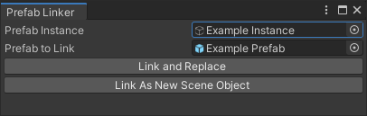

# PrefabLinker
A tool to re-connect an unpacked prefab instance to its original prefab (or one with a compatible hierarchy.)

# GUI Usage
Access the PrefabLinker GUI through the Tools -> Prefab Linker menu item.


* **Prefab Instance**: The unpacked/disconnected GameObject that you wish to link to a prefab.
* **Prefab to Link**: The prefab to which the GameObject will be linked (through the creation of a new prefab variant.)

You then have two options to proceed:
* **Link and Replace**: This will generate a new prefab variant and replace the original asset. This should only be used if the GameObject you supplied for **Prefab Instance** is itself a prefab.
* **Link As New Scene Object**: This will generate a new prefab variant and store it in the active scene. You may then drag it into your project to save it.

# Code Usage
The `NewBlood.PrefabLinker` class exposes a single public static method for generating a new prefab variant from an instance and prefab:
```cs
/// <summary>Creates a new variant of <paramref name="prefab"/> based on <paramref name="instance"/>.</summary>
/// <param name="instance">A GameObject with a hierarchy compatible with instances of <paramref name="prefab"/>.</param>
/// <param name="prefab">The prefab upon which the returned variant will be based.</param>
/// <returns>The new prefab variant, or <see langword="null"/> upon failure.</returns>
public static GameObject CreatePrefabVariant(GameObject instance, GameObject prefab)
```
